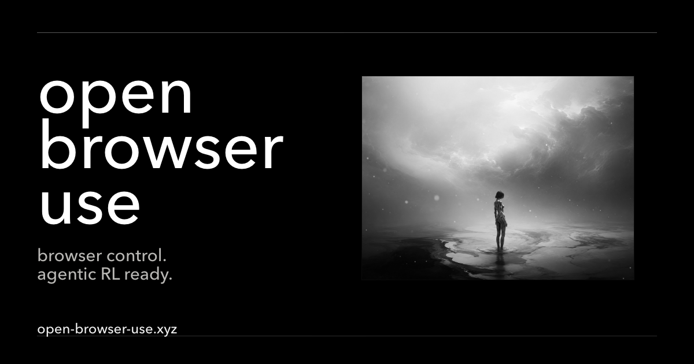

<div align="center">

<sub><b>English</b> · <a href="i18n/README.zh-CN.md">简体中文</a> · <a href="i18n/README.ja.md">日本語</a> · <a href="i18n/README.ko.md">한국어</a> · <a href="i18n/README.es.md">Español</a></sub>

<h1>open-browser-use</h1>

<p><b>Let agents control the browser you already use.</b></p>



<p align="center">
  
  
  
  <br>
  
  
  
</p>

<p>
  <a href="#install-current-preview">Install</a> ·
  <a href="#quickstart">Quickstart</a>  · 
  <a href="#what-your-agent-can-do">What it can do</a>  · 
  <a href="#how-it-works">How it works</a>  · 
  <a href="#agentic-rl-environment">Agentic RL</a>  · 
  <a href="#local-by-default">Local by default</a>
</p>

</div>

---

Your coding agent can reason, plan, and write code. But the moment a task lives behind a login, inside a dashboard with no API, or in a clicky multi-step web form, it hits a wall: plenty of brain, no hands on the browser. **open-browser-use gives it those hands** — driving *your* real, already-signed-in browser, entirely on your own machine.

## Your agent has a brain, but no hands

We love telling agents to "just handle it." The trouble is that so much of *it* lives in a browser tab:

- "Download every invoice from my email this quarter and add them up."
- "Reorder my usual groceries from the store I'm already logged into."
- "Pull the numbers off this dashboard — it has no export button."
- "Fill out this application using the details from that PDF."

None of these are hard to *think* about. They're hard because the agent can't *touch* the page. open-browser-use closes that gap, and tries to do it the friendly way:

- **Your real browser, your sessions.** It drives the Chrome you already use, with your logins and cookies — not a fresh, logged-out robot browser. So it can do your *actual* errands.
- **Local and private.** Everything runs on your machine. No cloud, no account, nothing phones home.
- **Works with the agents you already have.** Codex, Claude Code, Cursor, Gemini CLI, VS Code, and more — over the Model Context Protocol (MCP).
- **Open source**, MIT licensed.

## Install (current preview)

open-browser-use is a **macOS / Linux public preview** — the Chrome Web Store listing isn't live yet, so the extension ships through GitHub Releases. You set up one thing by hand: the browser extension. Your AI agent installs and connects everything else.

1. **[Download the extension](https://github.com/open-browser-use/open-browser-use/releases/latest/download/open-browser-use-extension.zip)** from the latest release, then unzip it.
2. **Load it into your browser:** open `chrome://extensions` (Chrome or another Chromium browser), turn on **Developer mode**, click **Load unpacked**, and select the unzipped folder. Pin it — its popup is how you connect your agent next.

> [!NOTE]
> Once the Chrome Web Store listing is live you'll add the extension straight from the Store — no download or unzip. For per-platform notes and troubleshooting, see [docs/install.md](docs/install.md) and [docs/troubleshooting.md](docs/troubleshooting.md).

## Quickstart

With the extension loaded, connecting it to your coding agent takes about a minute — no config files to hand-edit:

1. **Open the extension popup** and click **Copy for agent**.
2. **Paste it into your coding agent** (Codex, Claude Code, Cursor, Gemini CLI, …).
3. The agent **sets up the open-browser-use MCP server and connects to your browser.** That's it.

> [!TIP]
> Then just ask, in plain language:
> *"Open my GitHub notifications and summarize what actually needs my attention."*

## What your agent can do

Under the hood, your agent calls one `js` tool and writes against a Playwright-shaped SDK (the `agent` global). A whole turn of browser work is about this small:

```js
const browser = await agent.browsers.get("chrome");
const tab = await browser.tabs.current();
await tab.attach();                                   // take control of the tab
await tab.goto("https://news.ycombinator.com");
await tab.getByRole("link", { name: "new" }).click();
display(await tab.locator("h1").innerText());         // surface a result
await browser.turnEnded();                            // hand control back, keep the session
```

From there it can:

| Capability                         | What that means                                                                                                             |
| ---------------------------------- | --------------------------------------------------------------------------------------------------------------------------- |
| **Act on elements**          | Click, fill, type, press, select, hover — addressed by role, text, or CSS (the resilient Playwright way).                  |
| **Click by sight or DOM id** | Vision/coordinate and DOM-addressed modalities for when there's no clean selector — including across cross-origin iframes. |
| **Read & extract**           | Text, tables, attributes, and screenshots.                                                                                  |
| **Files & dialogs**          | Uploads, downloads, alerts, and confirms.                                                                                   |
| **Tabs, sessions & resume**  | Juggle multiple tabs and sessions, and resume long tasks across turns without losing its place.                             |

## How it works

Your agent talks to open-browser-use as an MCP server. It writes JavaScript through a single `js` tool, which runs in a persistent Node runtime where `agent` is the SDK. Those calls travel as JSON-RPC over a capability-gated, owner-only Unix socket to **`obu-host`** — a per-session broker that drives your browser through one of two backends:

```
your agent
   │  MCP over stdio              (the `js` tool; you write JS, the SDK is `agent`)
   ▼
obu-node-repl                     (MCP server + the Node runtime it spawns)
   │  JSON-RPC over an owner-only Unix socket   (capability-gated)
   ▼
obu-host                          (per-session broker daemon)
   ├─▶ WebExtension backend ─▶ your everyday Chrome        (MV3 + native messaging, no debug port)
   └─▶ CDP backend          ─▶ Chrome with remote debugging   (OBU_CDP_URL)
```

- **WebExtension backend** — drives a normally-installed Chrome through the open-browser-use extension. No `--remote-debugging-port`, your real profile and logins intact. This is the default for everyday use.
- **CDP backend** — attaches to any Chrome started with remote debugging (`OBU_CDP_URL`). Ideal for headless and scripted runs.

> [!IMPORTANT]
> Everything stays on your machine. `obu-host`'s socket is owner-only and authenticated by OS user, and only trusted SDK code holds the capability token to reach it — open-browser-use never calls out to a remote service.

<details>
<summary><b>Repo layout</b> — where each piece lives</summary>

| Path                              | What it is                                                                                                            |
| --------------------------------- | --------------------------------------------------------------------------------------------------------------------- |
| `crates/obu-wire`               | Shared JSON-RPC framing, envelopes, and error codes.                                                                  |
| `crates/obu-node-repl`          | The MCP server: spawns the Node runtime (where the SDK runs) and brokers its capability-gated socket to `obu-host`. |
| `crates/obu-host`               | The per-session broker daemon and the CDP / WebExtension backends.                                                    |
| `packages/sdk`                  | The agent-facing, Playwright-shaped TypeScript SDK (`@open-browser-use/sdk`).                                       |
| `packages/browser-control-core` | Pure protocol types, planners, and fixtures shared by the SDK and extension.                                          |
| `packages/cli`                  | The `obu` command line — `setup`, `verify`, `doctor`, and agent MCP wiring.                                  |
| `packages/extension`            | The Chromium MV3 extension and its native-host bridge.                                                                |

</details>

## Agentic RL environment

open-browser-use is built to double as an **environment for training and evaluating browser agents**, not just to run them. The reinforcement-learning core already exists; what's left is the harness around it.

**Already in place**

- **An env-shaped action/observation loop.** `tab.observe()` returns a typed `TabObservation`; `tab.step(action)` takes a typed `EnvAction` and returns an `ActionResult`. `EnvAction` spans **13 action kinds** across three addressing modes — `locator.*`, `dom_cua.*`, and `coordinate.*` — each with an optional capability `policy`.
- **Rich, structured step results.** `ActionResult` reports an `ActionEffect` (`navigation`, `dom_changed`, `download_started`, `no_visible_change`, …), `invalidatedObservations`, handles, advisories, and a structured `error` — enough signal to drive a learner or a verifier.
- **Durable episodes with recovery.** Sessions carry ownership arbitration, stale-handle diagnostics, owner-turn proofs, and `resume`, so long episodes survive crashes and reconnects. Tasks export to `EpisodeExport { task_id, turns, events }`.
- **High-level helpers** (`tab.act.*`, `tab.flows`, `tab.read`) layered on the same primitives.

**Not there yet** — there's no single `Environment` facade exposing a formal, sampleable `reset/step/observe/close`; `browser.reset()` only resets the viewport (the backend attaches to a browser rather than launching a disposable one); and there's no built-in verifier substrate, reward-bearing trajectory schema, parallel rollout fleet, or Python / network (HTTP/gRPC) client — today the surface is MCP-stdio plus the native-pipe broker.

### Roadmap to a trainable environment

Ordered by the critical path to *"can you actually train against it"*:

- [ ] **Env facade + language-neutral protocol + Python client** *(keystone)* — converge `reset/step/observe/close` behind an HTTP/gRPC surface (or adapters for common RL frameworks) so an external trainer can drive rollouts at scale.
- [ ] **Clean, seeded `reset()`** — let the backend launch a disposable browser with a fresh profile and fixed start URL, torn down at episode end. This single capability unlocks both reset *and* parallelism.
- [ ] **Verifier substrate (RLVR)** — a deterministic assertion library (`url_contains`, `text_visible`, `dom_query`, `download_produced`, JS predicate) plus `episode.evaluate({ assertions })`.
- [ ] **Training-ready trajectory schema** — type `EpisodeExport.turns` into `(obs, action, effect, reward, done)` records with standard JSONL / Hugging Face dataset export.
- [ ] **Parallel rollout fleet** — a pool of N isolated browsers with async stepping (builds on clean reset).
- [ ] **Determinism & reproducibility** — seeding, optional network record/replay, and fixed task instances with content hashing to detect live-web drift.

## Local by default

open-browser-use never calls a remote URL or product-policy service. SDK guards and host policy run locally and are permissive by default. Tighten them with environment variables when you need to:

| Variable                                                                      | Effect                                                               |
| ----------------------------------------------------------------------------- | -------------------------------------------------------------------- |
| `OBU_HOST_POLICY_DENY_ORIGINS`                                              | Block navigation and current-origin commands for the listed origins. |
| `OBU_HOST_POLICY_DENY_CDP_METHODS`                                          | Block specific raw CDP methods (`*` blocks all).                   |
| `OBU_HOST_POLICY_BLOCK_HISTORY` / `_BLOCK_DOWNLOADS` / `_BLOCK_UPLOADS` | Block history reads, downloads, or uploads.                          |
| `OBU_GUARD_MODE=disabled`                                                   | Local/testing bypass for all guard and policy checks.                |

SDK callers can also install per-browser `Guards` hooks for navigation, downloads, uploads, history, and raw CDP — they run in your local agent process and make no network request:

```ts
import { Guards } from "@open-browser-use/sdk";

const browser = await agent.browsers.get("chrome", {
  guards: new Guards({
    checkNavigation(url) {
      if (url.startsWith("https://admin.example/")) throw new Error("navigation blocked");
    },
  }),
});
```

## Build and test

```bash
cargo test --workspace
pnpm install --frozen-lockfile
pnpm -r build && pnpm -r test
```

Wire method names, SDK guard classes, host policy classes, and backend support states all come from `wire/methods.json`. After changing a wire method, regenerate the TS/Rust tables and run the currentness check:

```bash
pnpm generate:wire-methods
pnpm check:wire-methods
```

Packaging, coverage, and the ignored CDP / WebExtension end-to-end gates have their own scripts and setup; see [docs/install.md](docs/install.md), [docs/troubleshooting.md](docs/troubleshooting.md), and [docs/release-checklist.md](docs/release-checklist.md).

## License and notices

open-browser-use is MIT licensed — see [LICENSE](LICENSE). Release payloads also carry third-party components under their upstream licenses; details are in [LICENSE-THIRD-PARTY.md](LICENSE-THIRD-PARTY.md).

---

<div align="center">
<sub>Built with Rust + TypeScript · driven over the Model Context Protocol · macOS / Linux public preview</sub>
</div>
