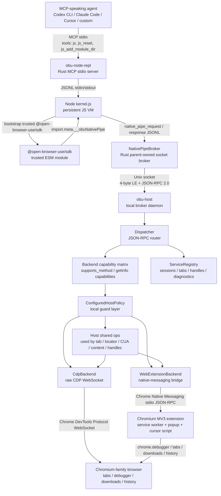
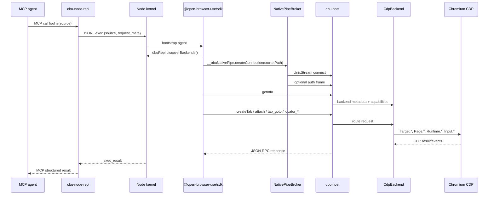
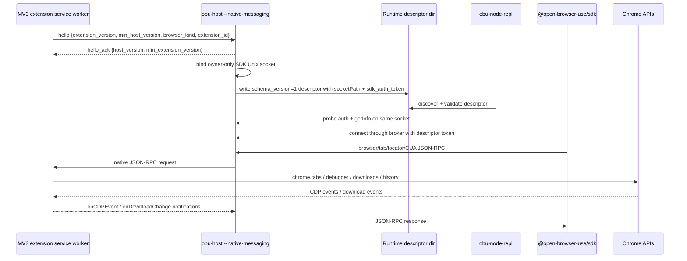
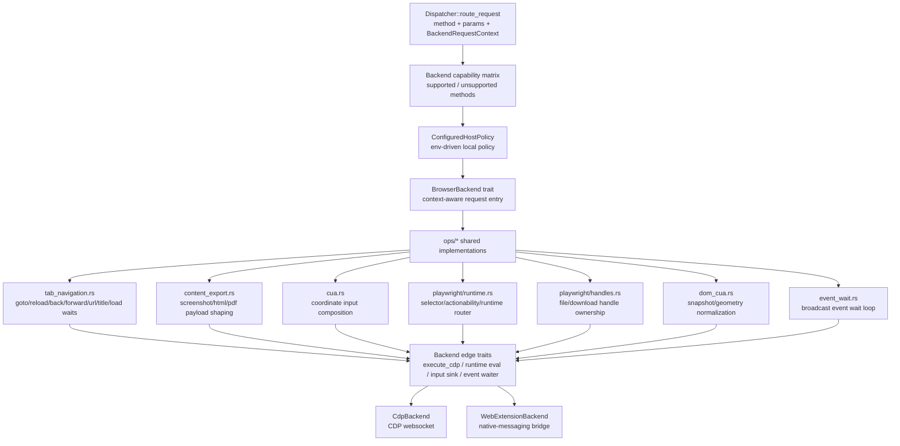
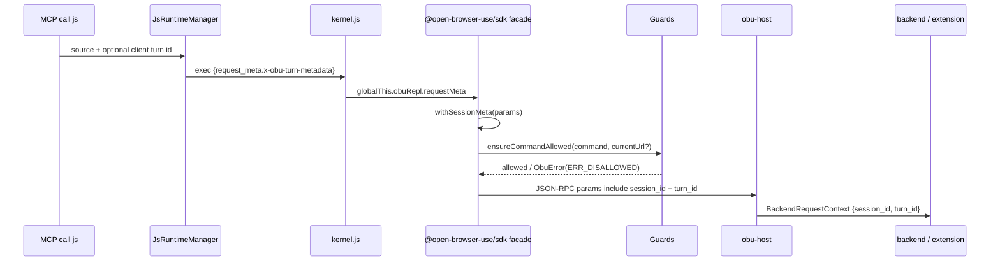
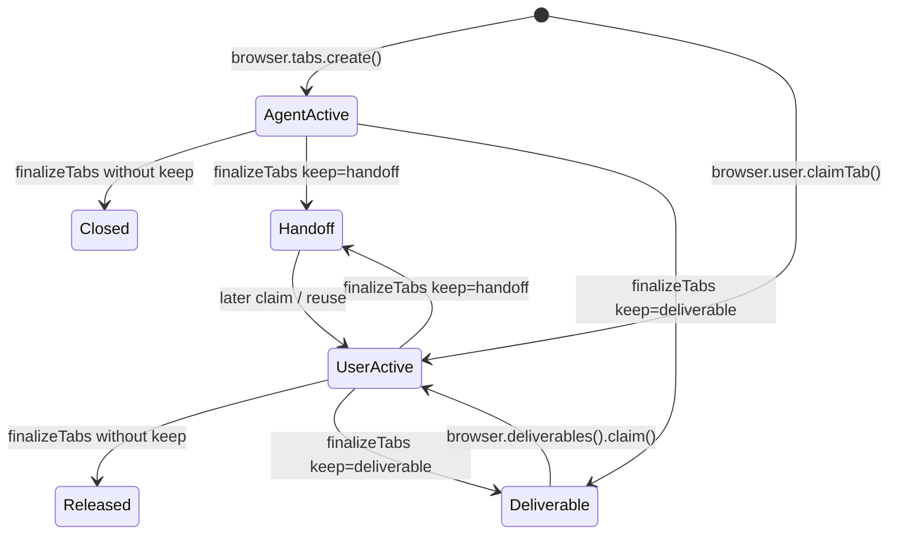
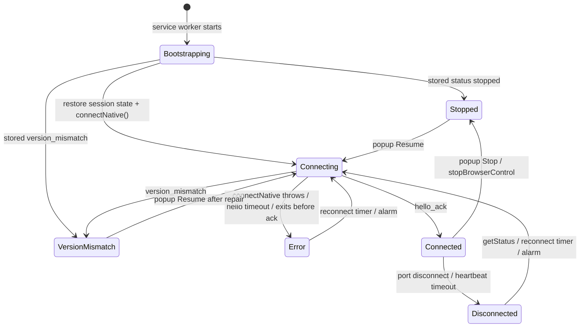
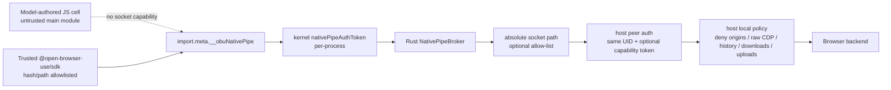
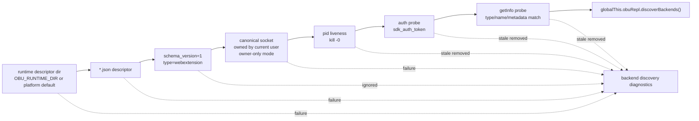

# open-browser-use 当前产品架构

**日期**: 2026-05-16
**范围**: 当前工作树中的产品运行路径，主要覆盖 `crates/obu-wire`、`crates/obu-node-repl`、`crates/obu-host`、`packages/sdk`、`packages/cli`、`packages/extension`。
**非运行主路径**: `target/`、`dist/`、`coverage/`、`node_modules/` 是构建或依赖产物，不视为产品架构源头。
**P4 说明**: 当前工作树已经包含 P4 release-spine 代码（runtime layout、doctor JSON、runtime-dir validator、path drift 诊断、CLI dispatcher、setup/install/update、agent adapters、npm/curl staging 等）。这些改动已有基础 smoke 覆盖，但仍不是 public release 完成证明；本文只描述当前实现状态。

## 1. 一句话架构

open-browser-use 是一个本地 browser computer-use runtime：任何 MCP 客户端通过 `obu-node-repl` 执行 JavaScript；受信任的 `@open-browser-use/sdk` 通过 Rust native-pipe broker 连接本地 `obu-host`；`obu-host` 统一做 JSON-RPC 分发、策略检查和生命周期状态管理，再路由到直接 CDP 后端或 Chromium MV3 WebExtension 后端去控制真实浏览器。

## 2. 仓库分层

| 路径 | 类型 | 当前职责 |
| --- | --- | --- |
| `crates/obu-wire` | Rust library | 共享 wire 类型、4-byte little-endian frame codec、JSON-RPC envelope、错误码、host-extension version handshake 类型。 |
| `crates/obu-node-repl` | Rust binary/library | MCP stdio server；管理 Node kernel；暴露 `js`、`js_reset`、`js_add_module_dir`；拥有 native-pipe broker。 |
| `crates/obu-host` | Rust binary/library | 本地 per-session broker daemon；绑定 Unix socket；peer auth；capability-token gate；dispatcher；host policy；CDP/WebExtension backends。 |
| `packages/sdk` | TypeScript ESM package | agent-facing Playwright-shaped SDK；安装 `agent`；发现后端；连接 host；提供 browser/tab/locator/CUA/dev/clipboard/content API。 |
| `packages/extension` | Chromium MV3 extension | Native Messaging client；`chrome.debugger` CDP proxy；tabs/history/downloads/session state；popup Stop/Resume；cursor content script。 |
| `packages/cli` | TypeScript CLI | P4 release-spine 状态：包含 dispatcher、`setup`、`install-host`、`update-extension`、`doctor`/`doctor browser`、doctor JSON envelope、runtime layout/validator、`mcp-config --print`、agent adapter wiring，以及 `mcp stdio` 缺 setup 时 clean stderr 失败；发布包装由顶层 `scripts/*` staging/smoke 脚本完成。 |
| `docs/wire-protocol.md` | 文档 | SDK/node-repl/host 的 P1/P2 wire reference。 |

## 3. 顶层组件图



## 4. 核心运行链路

### 4.1 MCP 到 JavaScript kernel

`obu-node-repl` 使用 `rmcp` over stdio 暴露三个工具：

| MCP tool | 作用 |
| --- | --- |
| `js` | 在持久 Node VM 中执行 JavaScript cell，返回 `stdout`、`stderr`、`result`、`duration_ms`、`displays`。 |
| `js_reset` | 杀掉并重启 Node kernel，清空 JS 状态和 SDK module state，但浏览器侧 host/session 状态可继续存在。 |
| `js_add_module_dir` | 将一个绝对路径加入后续 import 的 module search roots。 |

Rust `JsRuntimeManager` 负责：

- 解析 CLI/env 形成 `ManagerOptions`。
- 发现后端 inventory：`OBU_BACKENDS` / `OBU_EXTRA_BACKENDS`，以及 `${OBU_RUNTIME_DIR}` 或平台默认 runtime dir（Linux `$XDG_RUNTIME_DIR/obu`，否则 `/tmp/obu-<uid>`）下 `webextension/*.json` runtime descriptors。
- 校验 runtime descriptor 的目录、文件、socket 权限、pid 存活和 `getInfo` probe。
- 生成并启动临时目录中的 `kernel.js` 与 `meriyah.umd.min.js`。
- 通过 JSONL 协议向 kernel 发送 `exec`、`add_module_dir`、native-pipe responses/data/closed。
- 从 kernel stdout demux `ready`、`display`、`exec_result`、`native_pipe_request`。

### 4.2 JavaScript kernel 到 SDK

Node kernel 做四件关键事：

1. 创建持久 VM context，补齐常用 Node/Web globals。
2. 将每个 `js` 调用编译为新的 ESM cell，并通过 `@prev` synthetic module 维持 REPL 式顶层变量状态。
3. 根据 hash/path trust gate，只给受信任模块的 `import.meta` 注入 `__obuNativePipe` 和 privileged `nodeRepl` 能力。
4. 在 bootstrap 时尝试导入 `@open-browser-use/sdk`，执行 `setupObuRuntime({})`，并锁定全局 `agent` 和 `help`。

普通用户 JS 主模块不会直接得到 native socket 能力；受信任的 `@open-browser-use/sdk` 通过 `import.meta.__obuNativePipe` 得到连接能力。

### 4.3 SDK 到 host

SDK 的连接流程是 lazy 的：

1. `setupObuRuntime()` 只创建 `Agent`。
2. 用户调用 `agent.browsers.get(kind)` 时，SDK 读取 `globalThis.obuRepl.discoverBackends()`。
3. `Browsers.selectBackend()` 按 kind 选择后端：
   - `cdp` 强制选择 CDP。
   - `chrome` / `edge` / `brave` / `arc` / `chromium` / `playwright` 优先最新 WebExtension descriptor，再 fallback 到 CDP。
   - exact socket path 或唯一 name 可直接命中。
4. SDK 调用 `import.meta.__obuNativePipe.createConnection(socketPath)`。
5. kernel 将请求发给 Rust `NativePipeBroker`。
6. Broker 校验 socket path、可选 allow-list，并代表 SDK 打开 Unix socket。
7. 若有 per-socket token 或 `OBU_CAPABILITY_TOKEN`，Broker 在第一帧 prepend `auth`。
8. SDK 在连接上创建 `Transport`，发送 `getInfo`，再构造 `Browser`。

### 4.4 Host dispatcher

`obu-host` 的正常 socket 模式：

- 绑定 `${OBU_HOST_SOCKET_PATH}` 或基于 `${OBU_SESSION_ID}` 生成的默认 Unix socket。
- socket 目录 `0700`，socket 文件 `0600`。
- `OBU_PEER_AUTH=auto|strict|off`；Unix 当前实现校验 same effective UID。
- 如果配置了 capability token，第一帧必须是 `auth`，错误码为 `ERR_PEER_AUTH = -1100`。
- 每个 peer 连接由 `Dispatcher::serve_peer()` 处理。
- dispatcher 对每个 JSON-RPC request 并发 spawn route task。
- `params.client_timeout_ms` 会在 host 侧包一层 timeout。
- 路由前先检查 backend capability matrix，再执行 local host policy，再调用 backend。

## 5. 两条浏览器后端路径

### 5.1 直接 CDP 路径

直接 CDP 后端适合 headless Chromium、Chrome for Testing 或任何开启 remote debugging 的 Chromium-compatible browser。



Agent-facing MCP browser-use details live in
[`docs/agent-browser-mcp-usage.md`](agent-browser-mcp-usage.md). The important
contract is: `tools/list` advertises `outputSchema`; `tools/call js` returns a
short text `content` plus the real `structuredContent`; JavaScript user-code
failures are tool results with `isError: true`; transport, timeout, and invalid
argument failures remain protocol errors.

Token-sensitive payloads are concentrated at the MCP boundary:

- `stdout`, final expression `result`, and `displays` are all returned in the
  final structured result.
- Text/JSON `display()` frames can stream as progress when the client provides a
  progress token, but they are still retained in final `displays`.
- Image displays and oversized base64 payloads with MIME metadata spill to
  per-session MCP resources; clients can fetch them with `resources/read`.

CDP 后端当前职责：

- `resolve_browser_ws()` 从 HTTP/WS CDP URL 找到 browser websocket endpoint。
- `CdpTransport` 管理 WebSocket request/response correlation 和 broadcast events。
- `targets` 创建、列举、claim、finalize、关闭 tab，并把浏览器 target 映射成 SDK `tab_id`。
- `attach` 为 tab 建立 flattened CDP session，记录 `cdp_session_id`，并启用 focus emulation。
- `execute` 暴露 raw `executeCdp`。
- `playwright` 实现共享 Playwright edge traits：注入 runtime、evaluate、文本输入、按键、locator click/hover/screenshot/event wait。
- `cua` 实现共享坐标输入 edge traits：CDP `Input.*`、navigation wait、drag 失败后的 best-effort release。
- `tab_navigation`、`content_export` 等共享 ops 通过 CDP `Page.*`、`Runtime.*`、`DOM.*` 完成具体浏览器操作。
- 下载与 file chooser 通过 CDP events 和 registry handle 管理。

### 5.2 WebExtension + Native Messaging 路径

WebExtension 路径适合控制用户已安装的 Chromium-family profile，不需要 `--remote-debugging-port`。



Native Messaging mode 在 `obu-host --native-messaging` 中完成：

- 第一帧必须是 extension `hello`，host 做 semver compatibility check。
- 成功后回 `hello_ack`。
- host 创建 WebExtensionBackend，并绑定一个 SDK Unix socket。
- host 写 runtime descriptor 到 `${OBU_RUNTIME_DIR}` 或平台默认 runtime dir（Linux `$XDG_RUNTIME_DIR/obu`，否则 `/tmp/obu-<uid>`）下的 `webextension/`；runtime root 和 `webextension/` 必须是 owner-only real directory：
  - `schema_version: 1`
  - `type: "webextension"`
  - `name`
  - `socketPath`
  - `sdk_auth_token`
  - `pid`
  - `startedAt`
  - `metadata`
- descriptor 文件 `0600`，目录 `0700`；Drop 时删除 descriptor。
- popup Stop 会发 `stopBrowserControl`，host 标记 backend inactive、移除 descriptor、停止接受新 SDK peers。

WebExtensionBackend 当前职责：

- `ensure_active()` 作为 Stop 后的 backend gate；inactive 后拒绝新请求。
- 对 context-required 方法强制要求 `session_id` 和 `turn_id`，再把它们透传给 extension。
- 将 host JSON-RPC request 转发为 native-messaging request，并接收 extension 侧 response/notification。
- 通过 `chrome.debugger` proxy 实现 `execute_cdp_with_context`，再复用 shared tab navigation、content export、Playwright runtime 和 CUA ops。
- 维护 WebExtension-only 能力：profile history、claim user tab、DOM-CUA、virtual clipboard、durable handoff/deliverable tabs。
- 将 extension 的 `onCDPEvent` / `onDownloadChange` notification 接入 host 事件等待和 registry handle 更新。

Extension service worker 当前职责：

- 自动连接 `dev.obu.host` native host。
- hello timeout、heartbeat、断线重连、alarm fallback、状态持久化。
- popup `GET_NATIVE_HOST_STATUS` / `STOP_BROWSER_CONTROL` / `RESUME_BROWSER_CONTROL`。
- JSON-RPC dispatcher：`createTab`、`getTabs`、`getUserTabs`、`claimUserTab`、`finalizeTabs`、`nameSession`、`turnEnded`、`getUserHistory`、`moveMouse`、`attach`、`detach`、`executeCdp`。
- session tab ownership、tab groups、handoff/deliverable 持久化。
- `chrome.debugger` attach lock 和 CDP proxy。
- `chrome.downloads` event 转 `onDownloadChange`。
- cursor content script 负责显示/隐藏 CUA 鼠标光标。

## 6. Host 共享操作层

`crates/obu-host/src/ops/` 是当前 host 架构里最容易被忽略、但最关键的复用层。dispatcher 只按 method 分组路由；CDP backend 和 WebExtension backend 只负责提供“边缘能力”；真正的参数解析、结果整形、事件等待、handle ownership 和跨后端一致行为尽量沉到 shared ops。



当前共享层拆分如下：

| 文件 | 抽象边界 | 复用的行为 |
| --- | --- | --- |
| `ops/tab_navigation.rs` | `TabNavigationBackend` | `Page.navigate`、reload、history back/forward、`wait_for_url`、`wait_for_load_state`、`location.href`、`document.title`；导航后允许 backend 刷新本地 tab metadata。 |
| `ops/content_export.rs` | `ContentExportBackend` | screenshot/html/pdf 的统一返回结构，`data` / `data_base64` / `mime_type`，以及截图 crop 参数到 CDP clip 的转换。 |
| `ops/cua.rs` | `MouseEventSink`、`KeyEventSink`、`NavigationWaiter` | CUA 方法分类、坐标/按钮/键盘参数解析、单击/双击事件序列、显式 navigation wait、拖拽失败后的释放兜底。 |
| `ops/playwright/runtime.rs` | `PlaywrightRuntimeBackend`、`PlaywrightTextInputBackend`、`PlaywrightCommandBackend` | Playwright-shaped locator 命令路由；区分直接 runtime evaluate 与需要 backend input edge 的 click/fill/press/hover；统一 actionability retry、timeout 和 selector 状态读取。 |
| `ops/playwright/handles.rs` | `ServiceRegistry` handle access | file chooser / download id 解析、session/tab ownership 校验、stale/consumed handle 诊断、download terminal event 匹配。 |
| `ops/dom_cua.rs` | `BackendRequestContext` + backend DOM/CDP edge | DOM-CUA node id 规范、viewport rect、box model rect、attribute 归一化、snapshot key 和可见节点集合。 |
| `ops/event_wait.rs` | `tokio::broadcast` receiver | 带 deadline 的事件匹配循环，用于 CDP/WebExtension 事件驱动等待。 |

这个分层带来的实际约束：

- 新增一个 browser backend 时，优先实现 shared ops 要求的 edge traits，而不是重写每个 method。
- 新增一个 SDK method 时，需要同时决定它是否能落在现有 shared ops；不能落入时再扩展 backend trait 或 capability matrix。
- 共享层只依赖 `BackendRequestContext`、method params、registry 和 backend edge，不应该知道 native-messaging descriptor、SDK transport 或 MCP kernel 细节。

## 7. Wire protocol

### 7.1 SDK/node-repl/host socket framing

`@open-browser-use/sdk` 到 `obu-host` 的 socket 使用：

```text
4-byte little-endian uint32 length
UTF-8 JSON-RPC 2.0 body
MAX_FRAME_LEN = 16 MiB
```

此通道当前没有 version handshake。`getInfo` 是约定上的第一条业务请求，但不是 dispatcher 强制握手。

如果 host 配置了 `OBU_CAPABILITY_TOKEN` 或 WebExtension descriptor 提供了 `sdk_auth_token`，broker 会在第一帧发送：

```json
{
  "jsonrpc": "2.0",
  "id": 0,
  "method": "auth",
  "params": { "capability_token": "..." }
}
```

kernel JS 和 SDK 不读取、不持有这个 token。

### 7.2 Host/Extension Native Messaging framing

`obu-host --native-messaging` 与 Chromium extension 的 stdio 通道也复用 `obu-wire::FrameCodec`，并额外使用：

- `hello`
- `hello_ack`
- `version_mismatch`
- JSON-RPC requests/responses/notifications

这个通道有独立的 extension/host semver compatibility check。

### 7.3 Error code ranges

| 范围 | 含义 |
| --- | --- |
| `-32xxx` | JSON-RPC 2.0 标准错误 |
| `-1000..-1099` | server / timeout / IO / protocol |
| `-1100..-1199` | guard / auth |
| `-1200..-1299` | backend / page / CDP |
| `-2000+` | user-program errors |

常用当前错误码：

| 常量 | 值 | 含义 |
| --- | ---: | --- |
| `ERR_TIMEOUT` | `-1000` | 请求或 defensive timeout |
| `ERR_NO_BACKEND` | `-1005` | 没有可用 browser backend |
| `ERR_PEER_AUTH` | `-1100` | peer auth 或 capability token 拒绝 |
| `ERR_CMD_DISALLOWED` | `-1102` | 命令级 guard 拒绝 |
| `ERR_PAGE_CLOSED` | `-1200` | page/target 已关闭 |
| `ERR_CDP_FAILURE` | `-1201` | CDP 命令失败 |
| `ERR_TAB_NOT_ATTACHED` | `-1202` | tab 未 attach |

## 8. API 与方法分层

### 8.1 SDK public surface

`@open-browser-use/sdk` 的主对象层级：

```text
agent
  browsers
    list()
    diagnostics()
    get(kind)
browser
  metadata / diagnostics / lifecycleDiagnostics / capabilities
  tabs.create/list/get
  user.openTabs/history/claimTab
  name()
  turnEnded()
  finalizeTabs() / finalize()
  deliverables()
  clearLifecycleDiagnostics()
tab
  attach/detach
  goto/reload/back/forward/close
  waitForURL/waitForLoadState/waitForNavigation
  screenshot/url/title
  locator(selector)
  frameLocator(selector)
  cua.*
  dom_cua.*
  dev.cdp()
  content.export()
  clipboard.*
locator
  click/dblclick/fill/press/hover/waitFor/count/...
```

### 8.2 SDK guard 与 session metadata 管线

SDK 的 public facade 不只是 thin client。每个会触达浏览器状态的 facade 会先构造 guard command，再把 `session_id` / `turn_id` 合并到 wire params，最后才通过 `Transport.sendRequest()` 发给 host。



| SDK 层 | 典型入口 | Guard 分类与上下文 |
| --- | --- | --- |
| `Browsers.get()` | `agent.browsers.get("chrome")` | 不直接触发 browser command；只做 backend selection、native-pipe connect、`getInfo`。 |
| `BrowserTabs` | `browser.tabs.create("https://...")` 或 `browser.tabs.create({ url })` | `create()` 是 `target-url`，用目标 URL 调 `checkNavigation`；无 URL 时创建 `about:blank`，避免落到扩展不可访问的 `chrome://newtab/`；`list()` 直接发 `GET_TABS`，host 侧 always-allowed；`get()` 只创建本地 `Tab` handle。 |
| `BrowserUser` | `openTabs()`、`history()`、`claimTab()` | `GET_USER_TABS`、`GET_USER_HISTORY`、`CLAIM_USER_TAB` 是 `history`，走 `checkHistory`。 |
| `Tab` | `goto/reload/back/forward/url/title/screenshot/close` | `goto/waitForURL` 是 `target-url`；多数 tab-local 方法是 `current-origin`，必要时先发 `TAB_URL` 取当前 URL。 |
| `Locator` / `FrameLocator` | `click/fill/press/readAll/screenshot` | 多数 locator 命令是 `current-origin`；`downloadMedia` 是 `download`；`#send` 会按 `needsCurrentUrl()` 决定是否读取 `TAB_URL`。 |
| `TabCua` / `TabDomCua` | 坐标点击、DOM snapshot、DOM click/type | 坐标/DOM 操作默认 `current-origin`；download media 走 `download`。 |
| `TabClipboard` / `TabContent` | clipboard read/write、content export | 均带 tab context；guard 需要 current URL 时先读 `TAB_URL`。 |
| `TabDev` | `tab.dev.cdp(method, params)` | `raw-cdp`：先做 current-origin 检查，再从 CDP params 中提取潜在 navigation URL，最后调用 `checkRawCdp`。 |
| `FileChooser` / `Download` handles | `setFiles()`、`path()` | upload/download 分类；host 侧再校验 handle 的 session/tab ownership。 |

`Guards.METHOD_CLASSIFICATION` 与 host policy 的分类刻意保持相近，但两者防护点不同：

- SDK guard 是 agent-facing 的可插拔 hook 层，默认 permissive；`OBU_GUARD_MODE=disabled` 会绕过。
- Host policy 是本地 daemon 的最终本地策略，默认也 permissive，但可通过环境变量阻断 origins、raw CDP methods、history、downloads、uploads。
- `TAB_URL` 自身也属于 `current-origin` 分类；SDK 为了给 guard 提供上下文会直接读 URL，因此 hook 实现要避免在 URL 读取上制造递归依赖。

### 8.3 Host method groups

`crates/obu-host/src/methods.rs` 与 `packages/sdk/src/wire/methods.ts` 同步维护 method constants，测试 `method_name_sync` 防止漂移。

| 方法组 | 示例 | 当前路由 |
| --- | --- | --- |
| health / introspection | `ping`, `getInfo` | dispatcher / backend metadata |
| tabs | `createTab`, `getTabs`, `claimUserTab`, `finalizeTabs` | backend context-aware methods |
| lifecycle | `nameSession`, `turnEnded`, `clearLifecycleDiagnostics` | backend registry + extension/session state |
| raw CDP | `attach`, `detach`, `executeCdp` | CDP backend or WebExtension debugger proxy |
| tab navigation/content | `tab_goto`, `tab_screenshot`, `tab_content_export`, `tab_url`, `tab_title` | shared tab ops + backend edge |
| Playwright locator | `playwright_locator_click`, `playwright_locator_fill`, `playwright_screenshot` | Playwright runtime + backend input edge |
| CUA coordinate | `cua_click`, `cua_type`, `cua_drag`, `moveMouse` | CDP Input or WebExtension bridge |
| DOM-CUA | `dom_cua_get_visible_dom`, `dom_cua_click`, `dom_cua_type` | WebExtension-capable path |
| clipboard | `tab_clipboard_read/write` | WebExtension virtual clipboard path |
| file/download handles | `playwright_wait_for_file_chooser`, `playwright_download_path` | registry handles + events |

Backend capabilities are exposed through `getInfo.capabilities.supported_methods` / `unsupported_methods`。当前 `CdpBackend` 不支持 profile history、CUA/DOM-CUA media download、DOM-CUA 和 tab clipboard 等 WebExtension-only surfaces；dispatcher 会先拒绝不支持方法。

## 9. 状态与生命周期

### 9.1 Host-side state

`ServiceRegistry` 是 host 可见的 per-session 内存状态中心，维护：

- browser-control sessions：`session_id`、`current_turn_id`、label、创建/更新时间、stale reason。
- tabs：SDK `tab_id` 到 backend target/tab 的映射；origin 为 `agent` 或 `user`；status 为 `active`、`handoff`、`deliverable`。
- Playwright injected marker。
- file chooser handles。
- download handles。
- stale tab / stale file chooser / stale download tombstones。
- compact diagnostics：counts、stale session summaries、deliverable tab summaries。

### 9.2 Tab lifecycle



WebExtension service worker 额外将 durable `handoff` / `deliverable` tab rows 存入 `chrome.storage.local`，在 service worker 或 native host 重启后恢复仍存在的 Chrome tabs。`browser.deliverables()` 会刷新 `getTabs` side channel 和 `getInfo` lifecycle diagnostics，再返回可 `claim()` 的 deliverable handles。

### 9.3 Handles lifecycle

File chooser 和 download 是 request/response handle 模式：

- `tab.waitForEvent("filechooser")` 记录 `file_chooser_id`。
- `FileChooser.setFiles(paths)` 消费 handle，错误会区分 never-seen 与 stale/consumed。
- `tab.waitForEvent("download")` 记录 `download_id`。
- `Download.path()` 等待 terminal download event，并返回完成路径。

Tab detach/close/finalize 或 registry cleanup 会清理相关 handle，并留下 stale tombstone 以便诊断。

### 9.4 Extension connection lifecycle

WebExtension service worker 是浏览器 profile 内的长期控制面，但 MV3 service worker 会被浏览器挂起/恢复，所以当前实现把 native-host 连接状态和 durable tab rows 持久化到 `chrome.storage.local`。



状态含义：

| 状态 | 产生条件 | 恢复路径 |
| --- | --- | --- |
| `connecting` | `chrome.runtime.connectNative("dev.obu.host")` 成功返回 port，并发送 `hello`。 | 等待 `hello_ack`，或 hello timeout 后进入 `error`。 |
| `connected` | host 回 `hello_ack`，记录 `hostVersion`，重置 reconnect backoff。 | 周期 heartbeat `ping` 失败或 port disconnect 后进入 `disconnected`。 |
| `disconnected` | 已连接后断开，或 heartbeat timeout。 | 指数退避 timer 与 `chrome.alarms` 双路径重连。 |
| `error` | native host 不存在、forbidden、crashed、hello timeout、hello 前退出。 | 指数退避重连；popup/doctor 可读 diagnosis。 |
| `stopped` | popup Stop 或 `stopBrowserControl`。 | 不自动重连；popup Resume 才重新进入 `connecting`。 |
| `version_mismatch` | host/extension semver handshake 不兼容。 | 不自动重连；修复版本后 popup Resume。 |

扩展内的 session lifecycle 与 host registry 配合：

- host 发给 extension 的 context-required browser request 必须同时带 `session_id` 与 `turn_id`；`ping`、`stopBrowserControl` 等控制请求例外。
- `createTab` 创建 agent-owned active tab；`claimUserTab` 创建 user-origin active tab。
- `finalizeTabs` 把 tab 转为 `handoff` / `deliverable` 或释放/关闭。
- `handoff` / `deliverable` rows 会持久化；service worker 或 native host 重启后通过现存 Chrome tab rehydrate。
- popup 状态会额外展示 deliverable tab 计数，提示用户可恢复产物。

## 10. 安全与信任边界



当前安全层从内到外：

| 层 | 位置 | 当前机制 |
| --- | --- | --- |
| JS capability injection | `kernel.js` | 只有 hash/path trusted imported modules 获得 `import.meta.__obuNativePipe`；main user cell 不获得。 |
| Kernel-broker handshake | `kernel.js` + `JsRuntimeManager` | kernel 启动发送随机 `nativePipeAuthToken`；后续 native-pipe request 必须 token 匹配。 |
| Broker socket policy | `NativePipeBroker` | socket path 必须绝对且可 canonicalize；Unix 要求目标是 socket；可用 `OBU_SANDBOX_ALLOWED_UNIX_SOCKETS` 限制。 |
| Capability token | broker + host | token 在 Rust 父进程中；broker prepend `auth`；SDK/kernel JS 不持有。 |
| Unix peer auth | `obu-host` | `auto/strict` 默认 same UID；`off` 仅本地调试。 |
| Socket permissions | `UnixSockListener` | parent dir `0700`，socket `0600`，绑定前用 `umask(0o177)`。 |
| SDK guards | `packages/sdk/src/guards.ts` | 默认 permissive，可插入 navigation/current-origin/history/download/upload/raw-CDP hooks。 |
| Host policy | `crates/obu-host/src/policy.rs` | 默认 permissive；env opt-in 阻断 origins、raw CDP methods、history、downloads、uploads。 |
| Extension permissions | `manifest.json` | `nativeMessaging`、`debugger`、`tabs`、`tabGroups`、`scripting`、`storage`、`history`、`downloads`、`alarms`、`<all_urls>`。不请求 bookmarks、top sites、clipboard。 |

Host policy 当前可通过这些环境变量收紧：

| 环境变量 | 控制面 |
| --- | --- |
| `OBU_HOST_POLICY_DENY_ORIGINS` | 阻断目标 URL 或当前 origin。 |
| `OBU_HOST_POLICY_DENY_CDP_METHODS` | 阻断指定 raw CDP method。 |
| `OBU_HOST_POLICY_BLOCK_HISTORY` | 阻断 user tabs/history/claim surfaces。 |
| `OBU_HOST_POLICY_BLOCK_DOWNLOADS` | 阻断 download/media download surfaces。 |
| `OBU_HOST_POLICY_BLOCK_UPLOADS` | 阻断 file chooser upload surfaces。 |
| `OBU_GUARD_MODE=disabled` | 同时让 SDK guard 与 host policy 进入 disabled mode。 |

本项目当前默认不调用远端 policy service，也没有 telemetry/phone-home policy oracle。

Runtime descriptor 是 WebExtension backend 被 SDK 发现的唯一持久入口，当前读取时做了额外收敛：



拒绝或忽略 descriptor 的主要条件：

- runtime registry 目录是 symlink、非当前用户所有，或 group/other 可读写执行。
- descriptor 文件是 symlink、非当前用户所有，或 group/other 可访问。
- `schema_version` 不是 `1`，`type` 不是 `webextension`，缺少 `socketPath` 或 `sdk_auth_token`。
- socket path 不能 canonicalize、不是 Unix socket、非当前用户所有，或不是 owner-only。
- `pid` 不存在或不存活。
- 500ms 内不能完成 `auth` + `getInfo` probe，或者 `getInfo` 返回的 type/name/metadata 与 descriptor 不一致。

这使 descriptor 不只是“文件发现机制”，也是 SDK 连接 WebExtension host 前的一道本地真实性检查。

## 11. 诊断与恢复

`packages/cli` 当前已经是 P4 release-spine 状态，不再只是单一
`doctor browser` 入口。它提供 `setup`、`install-host`、`update-extension`、
`doctor`、`doctor browser`、`mcp-config` 和 `mcp stdio` 的主要命令面；顶层
`scripts/` 负责 payload assembly、npm wrapper staging、curl artifact 和
release/package smoke。

```text
node packages/cli/dist/index.js --version
node packages/cli/dist/index.js setup --yes --skip-extension --skip-agents
node packages/cli/dist/index.js install-host --browser chrome
node packages/cli/dist/index.js update-extension --no-wait
node packages/cli/dist/index.js doctor --json
node packages/cli/dist/index.js doctor browser --browser chrome
node packages/cli/dist/index.js doctor browser --browser chrome --json
node packages/cli/dist/index.js doctor browser --browser chrome --repair
node packages/cli/dist/index.js mcp-config --agent=codex-cli --print
```

诊断项覆盖：

- payload/CLI entry、bundled Node、host binary、node-repl binary、SDK package/dist、extension payload。
- user config malformed/unreadable/shape errors。
- extension manifest 和 required permissions。
- browser/profile 路径。
- extension 是否安装、是否 disabled，以及 unpacked extension loaded path 是否
  指向稳定 `extensionCurrentDir`。
- native host manifest 是否存在、path、allowed origin 是否正确。
- host binary version。
- runtime dir owner-only/symlink 安全性。
- runtime descriptor 目录、文件、socket、pid、auth、`getInfo` probe。
- agent config backup cleanup。
- lifecycle diagnostics：stale sessions/tabs/file choosers/downloads、deliverable tabs。

当前仍需要 release-gate 复审的点：

- `mcp-config --print` 在 repo mode 可以 fallback 到 `process.execPath +
  cliEntry`；生产/packaged adapter 配置必须继续证明它输出可执行的 installed
  `obu` shim。
- `setup` / `update-extension` 的 WebExtension boundary 仍需要真实 Chrome for
  Testing/Chromium gate 证明：无 descriptor 时 bounded `manual_action_required`，
  有 descriptor 时能完成 SDK browser task。
- npm scope 可用性、公网发布顺序、GitHub Release asset promotion 仍是外部
  release gate，不由本地 smoke 直接证明。
- Windows runtime/installer 仍不在 P4a；不能发布看起来支持 Windows 的 npm/curl
  artifacts。

`--repair` 当前是保守本地 repair：

- 重新生成 native-host wrapper 和 manifest。
- 创建 runtime descriptor dir。
- 修复 descriptor dir/file 权限。
- 移除明显 stale 的 descriptors。
- 对 live host 调 `clearLifecycleDiagnostics` 清理已确认 stale tombstones。

Extension popup 则提供用户可见状态、Stop/Resume 和针对 native host failure/version mismatch/deliverables 的恢复提示。

当前 P4 仍未完成的发布面：

- rename 后 P4 plan/checklist 与当前实现的最终复审。
- 全量 release checklist：JS/Rust/package/curl/setup/browser gates。
- 真实 Chrome for Testing 或 Chromium 的 WebExtension browser gate。
- npm scope/包发布权限确认与 release promotion。
- 对当前 release-gate caveats 的修复和复审。

## 12. 构建与测试拓扑

顶层 workspace：

- Rust: Cargo workspace，edition 2024，Rust 1.88。
- JS/TS: pnpm workspace，TypeScript 5.7.3，Node engine `>=22.22.0`。

主要命令：

```bash
cargo test --workspace
pnpm -C packages/sdk build
pnpm -C packages/sdk typecheck
pnpm -C packages/sdk test
pnpm -C packages/cli build
pnpm -C packages/cli test
pnpm -C packages/extension build
pnpm -C packages/extension test
```

端到端脚本：

| 脚本 | 作用 |
| --- | --- |
| `scripts/p2-e2e.sh` | 启动或复用 headless Chrome remote debugging，跑 CDP ignored E2E。 |
| `scripts/p3-webext-e2e.sh` | 构建 host/SDK/extension，安装临时 native-host manifest，跑 WebExtension ignored E2E。 |
| `scripts/ensure-chrome-for-testing.sh` | 准备 Chrome for Testing 到本地 cache。 |
| `scripts/coverage-rust.sh` | Rust coverage wrapper。 |

## 13. 当前边界与设计取舍

| 主题 | 当前状态 |
| --- | --- |
| Windows | 当前代码主体是 Unix socket/native-messaging dev path；Windows installer/native-host registration 在当前 README 中仍不是主路径。 |
| Direct CDP | 需要外部 Chromium 开启 remote debugging；不会自动启动浏览器。 |
| WebExtension | 开发安装通过 unpacked extension + native-host manifest writer；extension ID 由 manifest key 固定。 |
| Policy | 默认本地 permissive；强 policy 通过 SDK hooks 或 host env config opt in。 |
| Cookies/storage/evaluate | 不提供一等 SDK 方法；通过 `tab.dev.cdp()` 逃生口。 |
| AbortSignal | 当前用 `client_timeout_ms` 与 SDK defensive timeout，不提供 AbortSignal。 |
| Telemetry | 当前 runtime 不引入远程 telemetry 或 OpenAI product policy。 |

## 14. 代码阅读索引

| 目标 | 入口文件 |
| --- | --- |
| wire framing / envelopes | `crates/obu-wire/src/{frame.rs,envelope.rs,error.rs,version.rs}` |
| MCP server tools | `crates/obu-node-repl/src/mcp_server.rs` |
| Node kernel orchestration | `crates/obu-node-repl/src/repl_manager/mod.rs` |
| Node kernel JS runtime | `crates/obu-node-repl/embedded/kernel.js` |
| Native-pipe broker | `crates/obu-node-repl/src/native_pipe/{broker.rs,connection.rs,protocol.rs}` |
| host CLI / socket mode | `crates/obu-host/src/{main.rs,cli.rs}` |
| host dispatcher | `crates/obu-host/src/dispatcher.rs` |
| method constants | `crates/obu-host/src/methods.rs`, `packages/sdk/src/wire/methods.ts` |
| backend trait/capabilities | `crates/obu-host/src/backends/mod.rs` |
| shared host ops | `crates/obu-host/src/ops/{tab_navigation.rs,content_export.rs,cua.rs,dom_cua.rs,event_wait.rs}` |
| shared Playwright ops | `crates/obu-host/src/ops/playwright/{runtime.rs,handles.rs}` |
| CDP backend | `crates/obu-host/src/backends/cdp/` |
| WebExtension backend | `crates/obu-host/src/backends/webext/mod.rs` |
| Native Messaging mode | `crates/obu-host/src/native_messaging.rs` |
| host state registry | `crates/obu-host/src/service_registry.rs`, `crates/obu-host/src/tab_state.rs` |
| local host policy | `crates/obu-host/src/policy.rs` |
| SDK bootstrap | `packages/sdk/src/runtime.ts` |
| SDK backend selection | `packages/sdk/src/browsers.ts` |
| SDK transport | `packages/sdk/src/wire/transport.ts` |
| SDK browser/tab API | `packages/sdk/src/{browser.ts,browser_tabs.ts,browser_user.ts,tab.ts,locator.ts}` |
| SDK guards | `packages/sdk/src/guards.ts` |
| extension service worker | `packages/extension/src/background.ts` |
| extension popup | `packages/extension/src/popup.ts` |
| extension cursor content script | `packages/extension/src/cursor.ts` |
| native-host manifest writer | `packages/extension/scripts/write-dev-native-host-manifest.mjs` |
| browser doctor | `packages/cli/src/doctor-browser.ts` |
